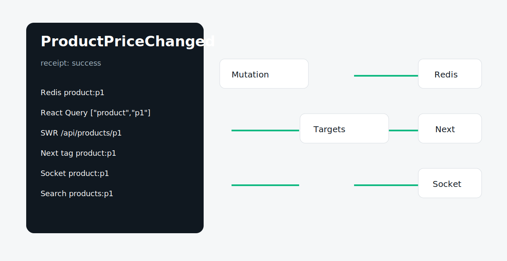
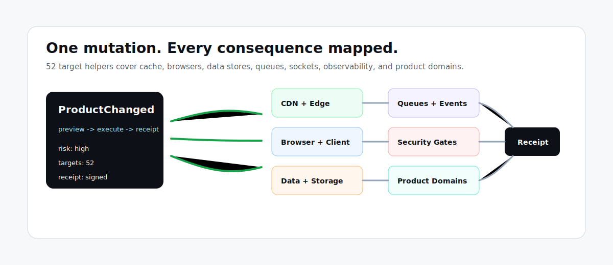
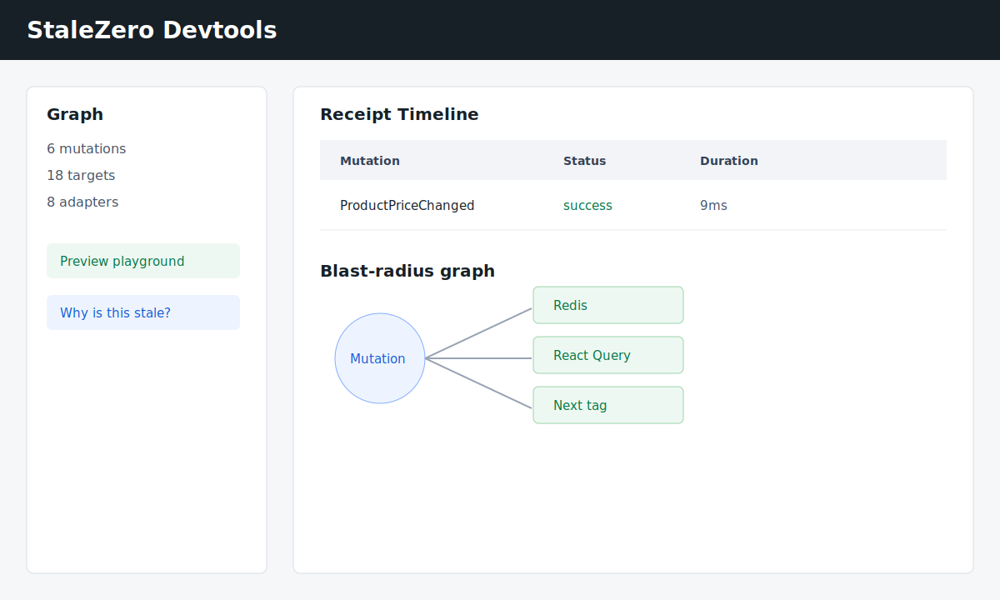
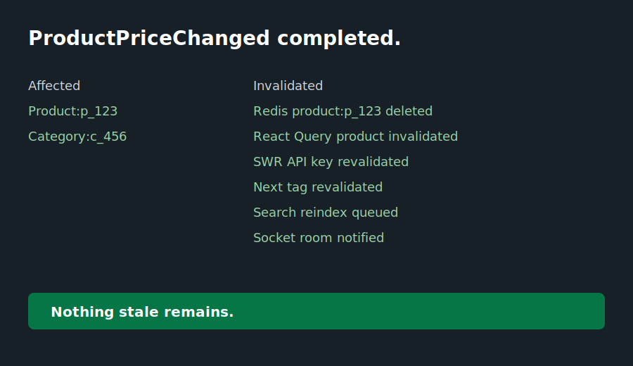

# StaleZero

<p align="center">
  
</p>

<p align="center">
  <strong>Ship mutations that explain themselves.</strong><br />
  Preview the blast radius, run the consequences, prove the result, and keep the receipt.
</p>

<p align="center">
  <a href="https://github.com/KirtiRamchandani/StaleZero/actions/workflows/ci.yml"></a>
  <a href="https://github.com/KirtiRamchandani/StaleZero/releases"></a>
  <a href="LICENSE"></a>
  
  
</p>

<p align="center">
  <a href="#quick-start">Quick start</a> /
  <a href="#why-this-exists">Why</a> /
  <a href="#what-ships-now">What ships now</a> /
  <a href="#target-helper-catalog">Target helpers</a> /
  <a href="#operations-layer">Operations layer</a> /
  <a href="#mutation-cockpit">Mutation cockpit</a> /
  <a href="#security-boundaries">Security</a> /
  <a href="#release-ready">Release ready</a>
</p>





## One Line

StaleZero is a mutation consequence engine: one named data change can clear Redis, invalidate React Query, revalidate SWR and Next, update Redux or Zustand, notify sockets, enqueue search, publish events, prove what happened, and leave a receipt.

```ts
await stale.changed("ProductPriceChanged", { productId: "p1" });
```

```txt
ProductPriceChanged completed.

Executed:
- ok redis product:p1 delete
- ok query ["product","p1"] invalidate
- ok swr /api/products/p1 revalidate
- ok next product:p1 revalidate
- ok socket product:p1 notify
- ok search products:p1 enqueue

Status: success
Duration: 9ms
```

## Hot Topics

- **Mutation receipts:** support artifacts for every cache, client, queue, socket, and service touched by a mutation.
- **Preview before impact:** see the blast radius before an adapter runs.
- **Adapter graph:** Redis, React Query, SWR, Redux, RTK Query, tRPC, Zustand, Next, Apollo, GraphQL, Cloudflare KV, WebSocket, search, HTTP, memory.
- **Distributed mode:** memory, Redis Pub/Sub, Redis Streams, Postgres notify/outbox, Kafka, NATS, HTTP webhooks.
- **Release candidate hardening:** clean-clone checks, npm pack checks, consumer smoke tests, CLI smoke tests, examples, benchmarks, provenance dry-run.
- **Production target surface:** 52 target helpers for browsers, edge cache, CDNs, data stores, queues, storage, product domains, workflow steps, and observability.
- **Cockpit layer:** Mutation Studio, snapshots, diff action, replay lab, contracts, recipes, compiler, batching, coalescing, SLOs, inbox, workflows, packs, and security gates.
- **Operations layer:** flows, undo, time machine, drift scans, impact scores, playbooks, owners, service contracts, schema registry, proofs, canaries, incident export, target replay, live watch, docs-as-code, migration scans, duplicate work scans, and cost reports.

## Quick Start

```bash
npm install stalezero
```

```ts
import {
  createStaleZero,
  entity,
  nextTagTarget,
  queryTarget,
  redisTarget,
  socketTarget,
  swrTarget
} from "stalezero";

export const stale = createStaleZero({
  app: "api",
  environment: process.env.NODE_ENV
});

stale.mutation("UserUpdated", {
  affects: ({ userId, teamId }: { userId: string; teamId: string }) => [
    entity("User", userId),
    entity("Team", teamId)
  ]
});

stale.mirror("RedisUser", {
  when: "UserUpdated",
  target: ({ userId }: { userId: string }) => redisTarget(`user:${userId}`)
});

stale.mirror("ReactQueryUser", {
  when: "UserUpdated",
  target: ({ userId }: { userId: string }) => queryTarget(["user", userId])
});

stale.mirror("SWRUser", {
  when: "UserUpdated",
  target: ({ userId }: { userId: string }) => swrTarget(`/api/user/${userId}`)
});

stale.mirror("NextUserTag", {
  when: "UserUpdated",
  target: ({ userId }: { userId: string }) => nextTagTarget(`user:${userId}`)
});

stale.mirror("UserRoom", {
  when: "UserUpdated",
  target: ({ userId }: { userId: string }) =>
    socketTarget(`user:${userId}`, { event: "user.changed" })
});

const preview = await stale.preview("UserUpdated", {
  userId: "123",
  teamId: "456"
});

console.log(preview.toText());

await db.user.update({ where: { id: "123" }, data });

const receipt = await stale.changed("UserUpdated", {
  userId: "123",
  teamId: "456"
});

receipt.assertSuccess();
```

## Quick Builder

Use inline mode when the mutation is local and you want the fastest path.

```ts
await stale
  .mutate("UserUpdated", { userId, teamId })
  .redis(`user:${userId}`)
  .query(["user", userId])
  .swr(`/api/user/${userId}`)
  .nextTag(`user:${userId}`)
  .socket(`user:${userId}`, "user.changed")
  .run({ consistency: "strict" });
```

## Operations Layer

The newest StaleZero surface handles the part teams usually debug during incidents: safe mutation journeys, reversible operations, drift, ownership, contracts, and proof.

```ts
await stale
  .flow("CancelOrder", { orderId })
  .step("refund-payment", refundPayment, { retry: 2, timeoutMs: 5000 })
  .parallel("cleanup", [
    { name: "return-inventory", run: returnInventory },
    { name: "send-email", run: sendEmail, options: { optional: true } }
  ])
  .changed("OrderCancelled")
  .run();
```

```ts
stale.undoable("UserRoleChanged", {
  windowMs: 30 * 60_000,
  authorize: ({ actor }) => actor?.role === "admin",
  undo: async ({ input }) => restorePreviousRole(input)
});

const receipt = await stale.changed("UserUpdated", input, { prove: true });
const drift = await stale.drift.scan("User", input.userId);
const impact = await stale.impact("TenantDeleted", input);
```

| Feature | What it gives you |
| --- | --- |
| Flows | Ordered, parallel, optional, retryable, compensating mutation steps. |
| Undo | Preview and run reversible mutation actions with safe dependent invalidations. |
| Time Machine | Search receipts, compare old receipts to the current graph, export incidents. |
| Drift Detector | Probe whether real targets match the mutation graph expectation. |
| Impact Score | Score mutation risk before execution. |
| Playbooks | Deterministic recovery steps for failed adapters and targets. |
| Owners | Owners in manifests, receipts, diagnostics, and generated CODEOWNERS lines. |
| Service Contracts | Producer and consumer schema checks for mutation events. |
| Schema Registry | Versioned local schemas, diffs, docs, and compatibility matrix. |
| State Proofs | Adapter `verify()` hooks that prove required systems reacted. |
| Canary Mutations | Dry-run readiness checks before production use. |
| Target Replay | Replay failed, safe, required, adapter-only, or exact targets. |
| Cost Meter | Estimate mutation target cost and external call pressure. |

## Why This Exists

Modern apps copy the same source data into many places:

| Layer | Native tool | What StaleZero adds |
| --- | --- | --- |
| Server cache | Redis, KV | One mutation receipt for every key and pattern. |
| Client cache | React Query, SWR, RTK Query | Coordinates cache invalidation with server-side effects. |
| UI state | Redux, Zustand | Dispatches or updates state as one target in the graph. |
| Framework cache | Next tags and paths | Keeps server revalidation visible and testable. |
| Realtime | WebSocket, Socket.IO | Links notifications to the mutation that caused them. |
| Async work | Search, jobs, webhooks | Records queued consequences and failures. |
| Services | Buses and outboxes | Correlates distributed events with receipts. |

StaleZero does **not** replace these tools. It coordinates them.

## Devtools Preview





```ts
import { createDevtoolsWebHandler } from "@stalezero/devtools";

const handler = createDevtoolsWebHandler(stale, {
  auth: (request) => request.headers.get("authorization") === `Bearer ${process.env.DEVTOOLS_TOKEN}`,
  cors: { origin: "https://admin.example.com" },
  payloadLimitBytes: 64_000,
  redact: ["token", "email"]
});
```

Devtools are disabled by default in production handlers.

## What Ships Now

| Area | Status |
| --- | --- |
| `createStaleZero()` | Stable |
| `changed()`, `preview()`, `why()` | Stable |
| Receipts, JSON output, pretty text output | Stable |
| Graph mode, quick builder, command mode | Stable |
| Type-safe mutation inputs | Stable |
| Strict, best-effort, dry-run | Stable |
| Timeout, retry, backoff, jitter, priority, concurrency | Stable |
| Dedupe, idempotency keys, payload limits | Stable |
| Required and optional target behavior | Stable |
| Receipt retention and bulk export | Stable |
| Health checks, readiness, graceful shutdown | Stable |
| Memory adapter and test helpers | Stable |
| Redis, React Query, SWR, Next adapters | Stable |
| Redux, RTK Query, tRPC, Zustand, Apollo, GraphQL | Stable |
| Cloudflare KV, WebSocket, search, HTTP adapters | Stable |
| Memory, Redis, Postgres, Kafka, NATS, HTTP buses | Stable |
| 52 target helper catalog | Stable |
| Devtools, CLI, OpenTelemetry hooks | Stable |
| Adapter template starter kit | Stable |

## Target Helper Catalog

StaleZero now ships 52 production-ready helper factories so mutation graphs can describe nearly every consequence a product app has to coordinate.

| Group | Helpers |
| --- | --- |
| Browser and edge | `browserCacheTarget`, `cookieTarget`, `localStorageTarget`, `broadcastChannelTarget`, `serviceWorkerTarget`, `edgeConfigTarget`, `denoKvTarget`, `bunSqliteTarget` |
| CDN and framework cache | `cdnTarget`, `cdnPurgeTarget`, `cloudfrontTarget`, `fastlyTarget`, `vercelCacheTarget`, `netlifyCacheTarget`, `cloudflareCacheTarget`, `imageCacheTarget` |
| Messaging and delivery | `webhookTarget`, `queueTarget`, `topicTarget`, `streamTarget`, `emailTarget`, `smsTarget`, `pushTarget`, `analyticsTarget`, `metricsTarget`, `auditLogTarget` |
| Data and storage | `objectStorageTarget`, `s3Target`, `blobTarget`, `prismaTarget`, `drizzleTarget`, `typeormTarget`, `sequelizeTarget`, `mongoTarget`, `postgresNotifyTarget`, `outboxTarget`, `deadLetterTarget` |
| Product domains | `featureFlagTarget`, `permissionTarget`, `roleTarget`, `tenantTarget`, `billingTarget`, `stripeTarget`, `inventoryTarget`, `catalogTarget`, `cartTarget`, `checkoutTarget`, `orderTarget`, `workflowTarget`, `cronTarget`, `indexTarget`, `sessionTarget` |

```ts
await stale
  .mutate("ProductPriceChanged", { productId: "p1" })
  .target(cdnPurgeTarget("fastly", "product:p1"))
  .target(indexTarget("products", "p1"))
  .target(webhookTarget("https://worker.example.com/invalidate", {
    meta: {
      requireHttps: true,
      allowHosts: ["worker.example.com"],
      blockPrivateIps: true
    }
  }))
  .run({ consistency: "strict" });
```

## Install Smaller

```bash
npm install @stalezero/core @stalezero/redis @stalezero/react-query @stalezero/next
```

## CLI

```bash
npx stalezero init
npx stalezero validate
npx stalezero preview UserUpdated '{"userId":"123"}'
npx stalezero graph
npx stalezero devtools
npx stalezero receipt receipt_123
npx stalezero why ReactQueryUser
npx stalezero list mutations
npx stalezero list targets
```

## Packages

| Package | Purpose |
| --- | --- |
| `stalezero` | Main package with core and common adapters |
| `@stalezero/core` | Framework-agnostic mutation engine |
| `@stalezero/redis` | Redis key, pattern, publish, and stream adapter |
| `@stalezero/react-query` | TanStack Query invalidation adapter |
| `@stalezero/swr` | SWR mutate adapter |
| `@stalezero/redux` | Redux dispatch adapter and reducer helper |
| `@stalezero/rtk-query` | RTK Query tag and endpoint adapter |
| `@stalezero/trpc` | tRPC utility adapter |
| `@stalezero/next` | Next.js tag and path revalidation adapter |
| `@stalezero/apollo` | Apollo cache adapter |
| `@stalezero/graphql` | GraphQL cache/view target helpers |
| `@stalezero/cloudflare-kv` | Cloudflare Workers KV adapter |
| `@stalezero/websocket` | Socket and WebSocket notification adapter |
| `@stalezero/search` | Search reindex queue adapter |
| `@stalezero/http` | HTTP webhook target adapter |
| `@stalezero/testing` | Test engine, fake stores, matchers, contract helpers |
| `@stalezero/cli` | Project CLI |
| `@stalezero/devtools` | Timeline, graph, preview, why, export handlers |
| `@stalezero/otel` | Trace spans from receipts and adapter timings |
| `@stalezero/snapshot` | Snapshot files and blast-radius diff helpers |
| `@stalezero/github-action` | Mutation diff and security review reporters |
| `@stalezero/recipes` | User, product, order, search, and page recipes |
| `@stalezero/pack-saas` | SaaS domain mutation defaults |
| `@stalezero/pack-commerce` | Commerce domain mutation defaults |
| `@stalezero/pack-auth` | Auth and session mutation defaults |
| `create-stalezero-adapter-template` | Adapter authoring starter kit |

## Mutation Cockpit

The shipped core is the engine. The cockpit layer makes mutation consequences visible in code review, devtools, release checks, and production debugging.

<details open>
<summary><strong>1. Mutation Studio</strong></summary>

**Problem:** developers need to know what a mutation affects, which cache updates, which clients receive notifications, which services receive events, and which adapter failed last time.

**Shipped base:** a visual-data API for mutation design, preview, replay, comparison, and debugging. The devtools package renders the graph and receipt views; the core exposes the studio switch and data hooks.

- Visual mutation graph
- Click mutation to see affected entities
- Click entity to see targets
- Click target to see adapter, action, risk, last receipt
- Preview mutation with sample payload
- Replay receipt in sandbox
- Compare two manifests
- Search by mutation, entity, adapter, target
- Filter failed, slow, unsafe targets
- Export JSON, SVG, HTML
- Copy runnable reproduction snippet

API:

```ts
stale.devtools({
  studio: true,
  preview: true,
  replay: true,
  compare: true
});
```
</details>

<details>
<summary><strong>2. Mutation Snapshots</strong></summary>

Snapshot a mutation blast radius so a pull request cannot silently remove an invalidation.

```bash
stalezero snapshot UserUpdated --userId=123 --teamId=456
```

Example output:

```txt
Mutation blast radius changed: UserUpdated

Removed:
- Next tag user:123

Added:
- WebSocket room user:123

Risk:
Medium
```

APIs:

```ts
await stale.snapshot("UserUpdated", input);
await stale.compareSnapshots(oldSnapshot, newSnapshot);
```
</details>

<details>
<summary><strong>3. Mutation Diff GitHub Action</strong></summary>

Code reviewers should see invisible behavior changes.

```yaml
- uses: stalezero/mutation-diff-action@v1
  with:
    manifest-before: .stalezero/main.json
    manifest-after: .stalezero/pr.json
```

Shipped pieces:

- Manifest comparator
- Markdown reporter
- Risk scoring engine
- PR comment output
</details>

<details>
<summary><strong>4. Mutation Replay Lab</strong></summary>

Receipts should be debuggable artifacts, not just logs.

```bash
stalezero replay receipt_123 --sandbox
```

Modes:

| Mode | Behavior |
| --- | --- |
| `sandbox` | Never touches real systems |
| `dry-run` | Calculates only |
| `safe-replay` | Executes idempotent targets only |
| `force` | Explicit dangerous replay |

API:

```ts
await stale.replay(receiptId, { mode: "sandbox" });
```
</details>

<details>
<summary><strong>5. Mutation Contract Tests</strong></summary>

Generate and run tests that prove mutation behavior.

```ts
contract("UserUpdated", {
  input: { userId: "123", teamId: "456" },
  affects: [
    ["User", "123"],
    ["Team", "456"]
  ],
  invalidates: [
    "redis:user:123",
    "query:user:123",
    "next:user:123"
  ]
});
```

CLI:

```bash
stalezero test-contracts
```
</details>

<details>
<summary><strong>6 to 20. Growth Features</strong></summary>

| Feature | What it unlocks |
| --- | --- |
| Target Helper Catalog | 52 ready-made helpers for cache, browser, data, storage, messaging, product, and workflow targets. |
| Mutation Recipes | `@stalezero/recipes` ships user profile, product catalog, webhooks, order lifecycle, search reindex, and page recipes. |
| Auto-Manifest Compiler | `stale.compileManifest()` and `stalezero compile` write indexed graph files. |
| Target Batching | Adapters can implement `batchExecute(targets, context)` and receipts record batch size. |
| Cache Stampede Shield | `stale.coalesce({ windowMs, by })` collapses repeated invalidations. |
| Mutation SLOs | `stale.slo()` evaluates duration, required targets, and failure-rate checks on receipts. |
| Causal Tracing | `traceId` flows through previews, receipts, events, replay, and black box entries. |
| Mutation Inbox | `stale.inbox()` stores, dedupes, verifies, processes, replays, and dead-letters events. |
| Mutation Workflows | `stale.workflow()` runs step receipts with idempotency and compensation hooks. |
| Mutation Templates | `stale.useTemplate()` and `template.entityMutation()` reduce repeated graph code. |
| Mutation Packs | SaaS, commerce, and auth packs install domain defaults. |
| Smart Defaults | `stale.resource("User", { cache: true, query: true, next: true, socket: true })`. |
| Interactive CLI Wizard | `stalezero init` creates a starter config; richer prompts remain intentionally small for now. |
| Recipe-to-Code Generator | `stalezero generate product-catalog`. |
| Mutation Documentation Generator | `stalezero docs` writes mutation markdown and graph HTML. |
| Developer Black Box Recorder | `stale.blackbox()` records safe mutation context, preview, receipt, timing, failures, and trace ID. |
| Operations Layer | Flows, undo, time machine, drift scans, proofs, canaries, playbooks, incidents, target replay, IDE diagnostics, and cost reports. |
</details>

## Security Boundaries

StaleZero makes dangerous mutation consequences hard to run accidentally.

<details open>
<summary><strong>Security boundaries</strong></summary>

| Feature | Purpose |
| --- | --- |
| Mutation Firewall | Blocks unsafe mutation execution before adapters run. |
| Tenant Boundary Guard | Stops cross-tenant mutations before target execution. |
| Safe HTTP Target Firewall | Requires HTTPS, supports host allowlists, and blocks private-network targets. |
| Redis/Cache Target Sandbox | Allows prefixes, denies wildcard patterns, and caps keys per mutation. |
| Secret Redaction Boundary | Protects receipts, devtools, buses, traces, and logs. |
| Approval Gates | Requires approval tokens for high-risk blast radius changes. |
| Risk Engine | Scores target count, adapter type, wildcard usage, HTTP targets, tenant scope, mutation name, and payload size. |
| Rate Limits | Prevents event storms, accidental loops, and refetch floods. |
| Supply-Chain Doctor | Checks lockfiles, release workflows, pinned actions, and security docs. |
| Security PR Inspector | Reports missing targets, wildcard-like targets, HTTP allowlist gaps, and production devtools exposure. |

APIs:

```ts
stale.security({
  mode: "strict",
  requireActor: true,
  requireSchema: true,
  requireTenantBoundary: true,
  blockUnsafeTargets: true
});

stale.tenant({
  actorTenant: ({ actor }) => actor.tenantId,
  inputTenant: ({ input }) => input.tenantId,
  blockCrossTenant: true
});

stale.sandbox("redis", {
  allowedPrefixes: ["user:", "product:", "team:"],
  denyPatterns: ["*", "session:*", "secret:*"],
  maxKeysPerMutation: 50
});

stale.rateLimit("ProductPriceChanged", {
  max: 10,
  windowMs: 60_000,
  key: ({ input }) => input.productId
});
```
</details>

## Release Ready

```bash
npm run verify:rc
npm run verify:clean-clone
```

The release candidate suite verifies:

| Check | Report |
| --- | --- |
| Clean install, typecheck, test, build, check | `reports/clean-clone-verification.md` |
| npm pack contents for every publishable package | `reports/npm-pack-verification.md` |
| ESM and CJS dynamic import consumer smoke tests | `reports/consumer-smoke-tests.md` |
| Built CLI commands | `reports/cli-smoke-test-report.md` |
| Adapter contracts | `reports/adapter-conformance-report.md` |
| Runnable examples | `reports/examples-run-report.md` |
| Adapter template starter kit | `reports/adapter-template-smoke-report.md` |
| Package graph and circular dependency check | `reports/package-graph-report.md` |
| Benchmarks | `reports/benchmark-report.md` |
| Security checks and license report | `reports/security-hardening-report.md` |
| Release dry-run with provenance | `reports/release-dry-run-report.md` |

## Current Benchmark Snapshot

The latest benchmark report measures preview latency, changed latency, receipt overhead, dedupe overhead, manifest loading, cold import time, memory delta, and core entry size.

```txt
Core ESM entry: measured in reports/benchmark-report.md
Preview 1,000 mutations / 10,000 targets: measured in CI-style local benchmark
Manifest loading: measured as table lookup path
```

## Docs

- [60-second quickstart](docs/quickstart.md)
- [Core concepts](docs/concepts.md)
- [Receipts](docs/receipts.md)
- [Preview mode](docs/preview.md)
- [Graph mode](docs/graph-mode.md)
- [Devtools](docs/devtools.md)
- [Mutation Studio](docs/mutation-studio.md)
- [Operations layer](docs/operations-layer.md)
- [Target helper catalog](docs/target-helper-catalog.md)
- [Snapshots, replay, and contracts](docs/snapshots-replay-contracts.md)
- [Recipes and packs](docs/recipes-packs.md)
- [CLI](docs/cli.md)
- [Production reliability](docs/reliability.md)
- [Security and privacy](docs/security.md)
- [Security boundaries](docs/security-boundaries.md)
- [Threat model](docs/threat-model.md)
- [Compatibility matrix](docs/compatibility.md)
- [Known limitations](docs/known-limitations.md)
- [API stability](docs/api-stability.md)
- [Adapter authoring](docs/adapter-authoring.md)
- [Release checklist](docs/release-checklist.md)

## What StaleZero Is Not

- Not a replacement for React Query, SWR, Redux, Next cache APIs, Redis, queues, or workflow engines.
- Not magic dependency discovery. You declare the graph.
- Not exactly-once distributed execution.
- Not a secret store.
- Not a production devtools endpoint without auth.

## License

MIT
